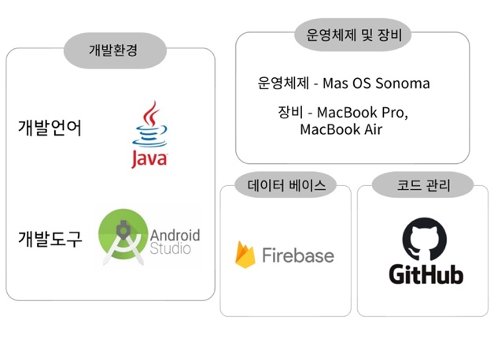
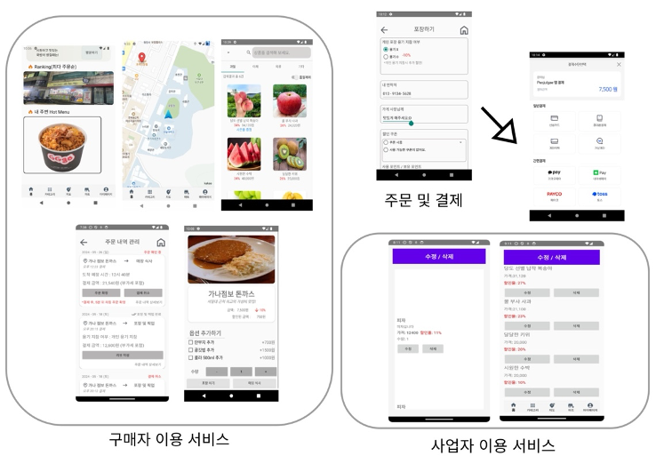
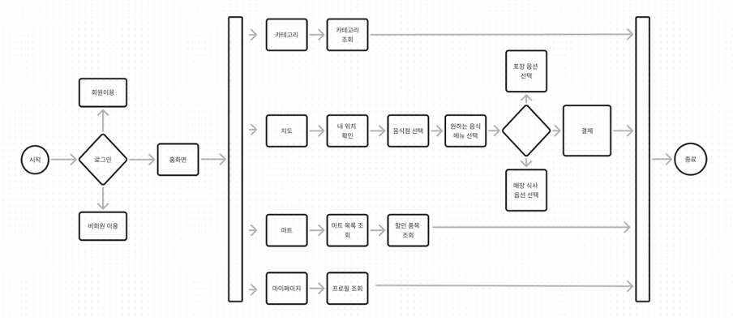
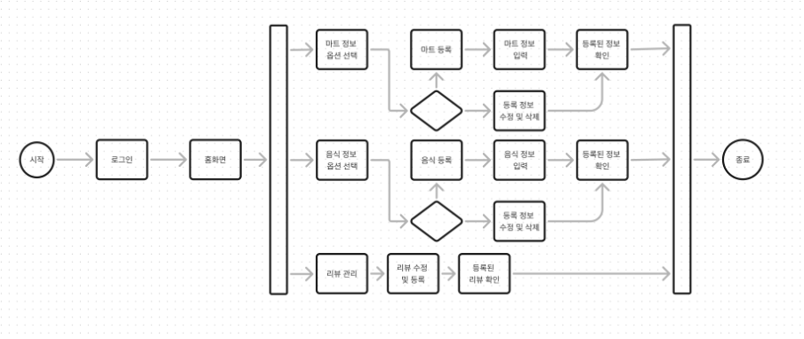

# **프로젝트명** : 퍼줄게 (Peojulgae)

**Team**: 다줄게조

---

## **개요**

물가 상승과 같은 원인으로 인해 여러 분야의 경제 활동이 침체되는 문제가 지속되고 있는 상황 속에서, 소상공인들은 감소하는 매출과 고정비용으로 인해 경영에 어려움을 느끼고 있습니다. 이러한 경제 및 사회를 바라보며 소상공인을 지원하고, 지역 사회 경제 활성화에 초점을 맞추어 ‘퍼줄게’ 프로젝트 개발을 진행하였습니다.

‘퍼줄게’ 애플리케이션을 통해 소비자들은 보다 할인된 가격에 끼니를 해결하고, 소상공인들은 매출을 보다 늘리며, 지역 사회 내의 경제 활동이 촉진되어 소상공인들의 경영을 지원하고, 지역 사회의 활력을 되찾을 수 있을 것으로 기대합니다.

---

## **주요기능**

### [사업자]

- 음식점 등록, 수정 및 삭제  
  - 사업자는 운영하는 음식점에 대한 위치, 전화번호와 같은 정보를 등록, 수정 및 삭제할 수 있다.
- 음식 메뉴 등록, 수정 및 삭제  
  - 사업자는 판매하는 음식 메뉴의 음식명, 가격, 할인율과 같은 정보를 등록, 수정 및 삭제할 수 있다.
- 마트 등록, 수정 및 삭제  
  - 사업자는 운영하는 마트의 위치, 전화번호와 같은 정보를 등록, 수정 및 삭제할 수 있다.
- 마트 할인 제품 등록, 수정 및 삭제  
  - 사업자는 판매하는 제품의 이름과 할인율과 같은 정보를 등록, 수정 및 삭제할 수 있다.

### [소비자]

- 지도 보기 및 위치 조회  
  - 소비자 근처 음식점 정보 확인이 가능하다.
- 음식점 최다 주문 순위 및 인기 메뉴 조회  
  - 소비자는 구매자의 주문수를 반영한 최다 주문 음식점과 인기 메뉴를 이미지 슬라이드로 확인이 가능하다.
- 마트 조회  
  - 이용하고자 하는 마트를 선택하고, 해당 마트에서 판매중인 품목의 할인 정보를 확인한다.
- 주문 및 결제  
  - 주문 시, 개인용기 지참 여부를 체크하여 추가 할인을 받을 수 있다.  
  - 소비자는 원하는 결제 수단을 선택하여 결제한다.

---

## **개발환경**

---

## **시스템 특징**

소비자는 홈화면에서 최다 주문 순위를 반영한 음식점들의 이미지와 인기 메뉴를 조회할 수 있습니다. 하단 메뉴바에서 카테고리, 지도, 마트, 마이페이지 기능 중 원하는 옵션을 선택할 수 있습니다. 지도 옵션 선택 시, 음식점의 할인 정보를 확인하고 원하는 메뉴를 선택하여 주문 및 결제가 가능합니다. 또한, 마트 옵션에서 이용하고자 하는 마트를 선택하게 되면 해당 마트에서 판매중인 품목들의 할인된 가격 정보가 디스플레이 됩니다.

사업자는 자신이 운영하는 가게 정보를 등록하고 판매하고자 하는 품목들을 등록, 수정 및 삭제하여 소비자에게 정보를 제공합니다.

---

## **시스템 구현 및 다이어그램**

### [소비자]

### [사업자]

---

## **기대효과 및 응용분야**

소비자에게 경제적 측면에서 합리적이고 유용한 서비스를 제공하여 수익을 창출할 수 있습니다. 애플리케이션을 이용하는 소비자 측면에서, 1인 가구가 증가하고 있는 만큼 이용자들은 ‘퍼줄게’에서 제공하는 할인된 가격 정보를 통해 저렴한 식사를 하고 식비를 절약하여, 경제적 안정성을 확보할 수 있습니다.

사업자가 얻을 수 있는 이익의 측면에서 대형마트 및 주변 마트 품목들에 대한 할인 정보 제공과 부가적인 기능으로 소비자의 소비 욕구를 자극하여 매출을 올릴 수 있습니다. 또한, 이용자에게 제공하는 서비스의 주요 목적을 할인 정보 제공으로 구성해, 소비자의 애플리케이션 이용을 늘리는 것은, 가게 홍보와 더불어 버려지는 음식물의 양을 최소화 함으로써 환경에 이바지하는 효과를 불러올 수 있습니다.

## **설치 및 실행방법**

	1.	KakaoMap API Key를 발급받아 AndroidManifest.xml에 추가하세요.
	2.	BootPay API Key를 발급받아 결제 기능을 설정하세요.
